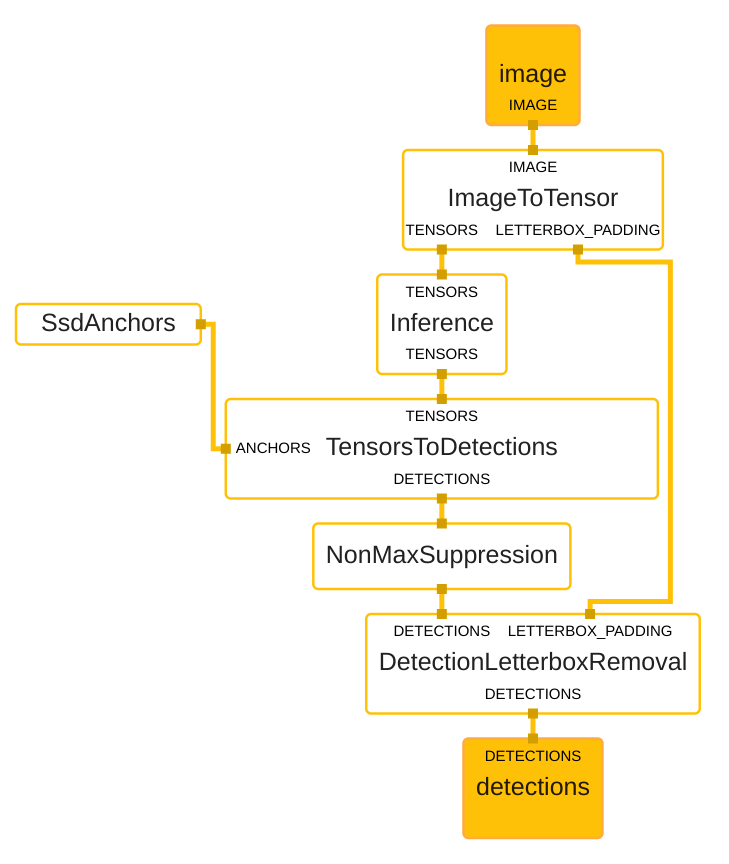
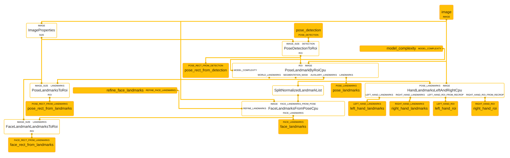
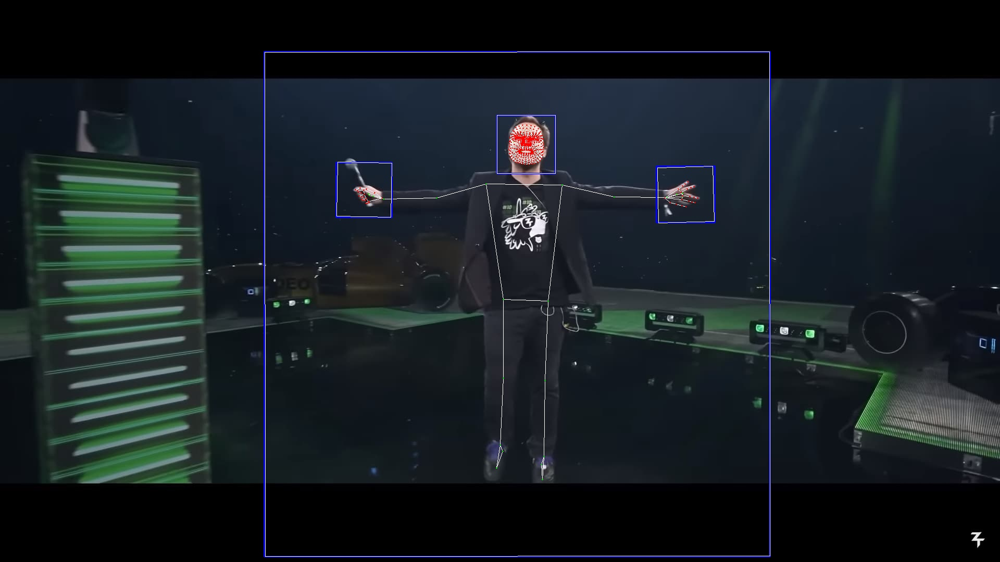

# Holistic Mediapipe

This code is a modification of the holistic pipeline of mediapipe.
The original holistic pipeline detects persons on an image, selects the biggest one and then detect body, face and hand poses for it.

As we want to be able to process multiple persons in a single image, the holistic pipeline has been splet into (1) body detection and, (2) poses detection.
More pipeline internal information have also been exposed as outputs (rbboxes).

Pipeline files (.pbtxt) creation/modification has been chalanging.
To visualise pipeline, one can use the online tool : [MediaPipe Visualiser](https://viz.mediapipe.dev/).

To be noted that, models are only available on CPU. 

## Pipelines

### pose_detection_cpu



### holistic_custom



## Process a Single Image

One can test the detection on an image and see detections rendered on it.

``` shell
python3 process_image.py \
    data/images/inputs/zerator_full.jpg \
    data/images/outputs/zerator_full.jpg \
    [--complexity 1] [--refine_face true]
```




## Extract Images Labels

Process all provided images and export detections as JSON formated texts aside.
To be noted that exported coordinates are normalised (based on image size).

``` shell
python3 extract_images_labels.py \
    "data/inputs/*.jpg" \
    [--workers 10] [--models 5] \
    [--complexity 1] [--refine_face true]
```

- `--models` allows to spawn multiple models to do multiple inferences in parrallel.
- `--workers` allows multi-threading. 
- You can (should) have more workers than models.

``` json
{
  "width": 1920,
  "height": 1080,
  "detections": [
    {
      "body": {
        "rbbox": {
          "cx": 0.5173537731170654,
          "cy": 0.5412694215774536,
          "w": 0.5046565532684326,
          "h": 0.8971672058105469,
          "r": 0.07683312892913818,
          "normalised": true
        },
        "bbox": {
          "x": 0.2644241769310286,
          "y": 0.09234785214105729,
          "w": 0.5058591923720736,
          "h": 0.8978431388727925,
          "normalised": true
        },
        "pose": [
          {
            "point": {
              "x": 0.5276418924331665,
              "y": 0.2548206150531769
            },
            "visibility": 1.0
          },
          ...
      },
      "face": {
        "rbbox": {...},
        "bbox": {...},
        "pose": [...], 
      },
      "left_hand": {
        "rbbox": {...},
        "bbox": {...},
        "pose": [...], 
      },
      "right_hand": {
        "rbbox": {...},
        "bbox": {...},
        "pose": [...], 
      }
    }
  ]
}
```

## Draw Label

``` shell
python3 draw_label.py \
  data/images/inputs/zerator_full.jpg \
  data/images/inputs/zerator_full.json \
  data/images/outputs/zerator_full.jpg 
```
